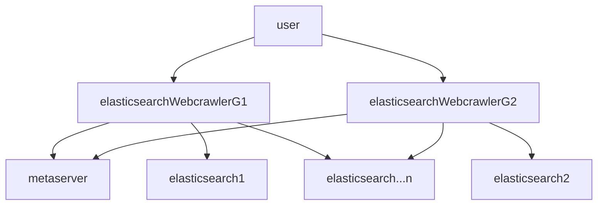

# elasticsearchWebcrawlerG

## elasticsearchWebcrawlerG 
# ==elasticsearch 활용 검색엔진 ==
PP 사에서 메타수급 시 출연진, 줄거리 등의 부족한 메타를 포털에서 수집해서 자동화시킬 수 있는지 확인한다.
elasticsearch 에 한글형태소를 적용하여 한글 검색이 가능한지 확인한다.

>  #목차
>  1. 개발환경
>  2. elasticsearch
>  3. 한글형태소(은전한닢 plugin) 설치
>  4. 추후 할 수 있는일

# 1. 개발환경
- jdk : java 1.7
- 프레임워크 : spring boot 1.4.1.RELEASE
- gradle build 옵션 : -x test clean build
- elasticsearchWebcrawlerG dependencies (war 배포)
        dependencies {
            compile('org.springframework.boot:spring-boot-starter-data-elasticsearch')
            compile('org.projectlombok:lombok')
            compile('org.springframework.boot:spring-boot-starter-thymeleaf')
            compile('org.springframework.boot:spring-boot-starter-web')
            compile group: 'edu.uci.ics', name: 'crawler4j', version: '4.2'	
            compile group: 'com.sun.jna', name: 'jna', version: '3.0.9'
            compile group: 'org.aspectj', name: 'aspectjweaver', version: '1.8.9'
            compile group: 'org.projectlombok', name: 'lombok', version: '1.16.10'  
            compile group: 'org.slf4j', name: 'slf4j-api', version: '1.7.21'
            compile group: 'ch.qos.logback', name: 'logback-classic', version: '1.1.7'
            compile group: 'org.lazyluke', name: 'log4jdbc-remix', version: '0.2.7'
            compile group: 'org.apache.commons', name: 'commons-lang3', version: '3.4'  
            compile group: 'com.google.guava', name: 'guava', version: '20.0'
            compile group: 'com.google.code.gson', name: 'gson', version: '2.8.0'
            compile group: 'org.apache.commons', name: 'commons-pool2', version: '2.4.2'
            compile group: 'io.springfox', name: 'springfox-swagger2', version: '2.6.0'
            compile group: 'io.springfox', name: 'springfox-swagger-ui', version: '2.6.0'    
            compile group: 'org.jsoup', name: 'jsoup', version: '1.10.1'    
            testCompile('org.springframework.boot:spring-boot-starter-test')
        }

# 2. elasticsearch 설치
- elasticsearch 설치(https://www.elastic.co/downloads/past-releases/elasticsearch-2-4-0)
        다운로드 wget https://download.elastic.co/elasticsearch/release/org/elasticsearch/distribution/tar/elasticsearch/2.4.0/elasticsearch-2.4.0.tar.gz
        압축해제 tar -xvzf elasticsearch-2.4.0.tar.gz
        실행 ./home/tvingadmin/server/elasticsearch-2.4.0/bin/elasticsearch

# 3. 한글형태소 분석기(은전한닢 plugin) 설치
- 은전한닢 설치 https://bitbucket.org/eunjeon/seunjeon/raw/master/elasticsearch/
		./elasticsearch-2.4.0/bin/plugin install org.bitbucket.eunjeon/elasticsearch-analysis-seunjeon/2.4.0.1

- 인덱스 설정
		curl -XPUT "http://localhost:9200/nmovie/?pretty" -d '
        {
          "settings": {
            "number_of_shards": 1,
            "number_of_replicas": 0,
            "index": {
              "analysis": {
                "tokenizer": {
                  "seunjeon_default_tokenizer": {
                    "type": "seunjeon_tokenizer",
                    "user_words": [
                    ]
                  }
                },
                "analyzer": {
                  "korean": {
                    "type": "custom",
                    "tokenizer": "seunjeon_default_tokenizer"
                  }
                }
              }
            }
          },
          "mappings": {
            "article": {
              "properties": {
                "code": {
                  "type": "string",
                  "index": "not_analyzed"
                },
                "nameKo": {
                  "type": "string",
                  "analyzer": "korean"
                },
                "nameEn": {
                  "type": "string",
                  "index": "not_analyzed"
                },
                "ntzScore": {
                  "type": "double",
                  "index": "not_analyzed"
                },
                "spcScore": {
                  "type": "double",
                  "index": "not_analyzed"
                },
                "poster": {
                  "type": "string",
                  "index": "not_analyzed"
                },
                "genresName": {
                  "type": "string",
                  "index": "not_analyzed"
                },
                "countryName": {
                  "type": "string",
                  "index": "not_analyzed"
                },
                "duration": {
                  "type": "integer",
                  "index": "not_analyzed"
                },
                "releaseDate": {
                  "type": "long",
                  "index": "not_analyzed"
                },
                "story": {
                  "type": "string",
                  "analyzer": "korean"
                },
                "actorsCode": {
                  "type": "string",
                  "index": "not_analyzed"
                },
                "actorsKo": {
                  "type": "string",
                  "analyzer": "korean"
                },
                "actorsEn": {
                  "type": "string",
                  "index": "not_analyzed"
                },
                "actorsImg": {
                  "type": "string",
                  "index": "not_analyzed"
                },
                "directorCode": {
                  "type": "string",
                  "index": "not_analyzed"
                },
                "directorKo": {
                  "type": "string",
                  "analyzer": "korean"
                },
                "directorEn": {
                  "type": "string",
                  "index": "not_analyzed"
                },
                "directorImg": {
                  "type": "string",
                  "index": "not_analyzed"
                },
                "grade": {
                  "type": "string",
                  "index": "not_analyzed"
                },
                "importer": {
                  "type": "string",
                  "analyzer": "korean"
                },
                "distributor": {
                  "type": "string",
                  "analyzer": "korean"
                }
              }
            }
          }
        }'
# 4. 추후 할 수 있는일
		기본적인 검색어 입력 후 검색되는 속도는 만족할 만하나 자동완성기능이 빠를지는 아직 확인하지 못했음.
    검색품질에 대한 다양한 구성테스트가 필요함.
    
    
    
    
